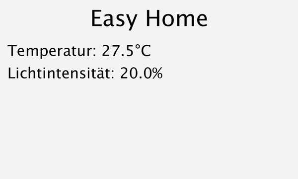

# EasyHome
A simple app to demonstrate hardware error handling in an home automation control environment for older people.

## Getting started

### Software

Install the [Processing IDE](https://processing.org/) and open EasyHome.pde.

### Hardware

U need to setup an [Arduino SIK](https://learn.sparkfun.com/tutorials/sik-experiment-guide-for-arduino---v32/introduction-sik-arduino-uno) and connect it through USB to ur computer.

## How it works
The app will connect to ur arduino and monitor the light sensor. If it is out of range, it will start an error dialog.

## License

The contents of this repository are covered under the [MIT License](LICENSE)